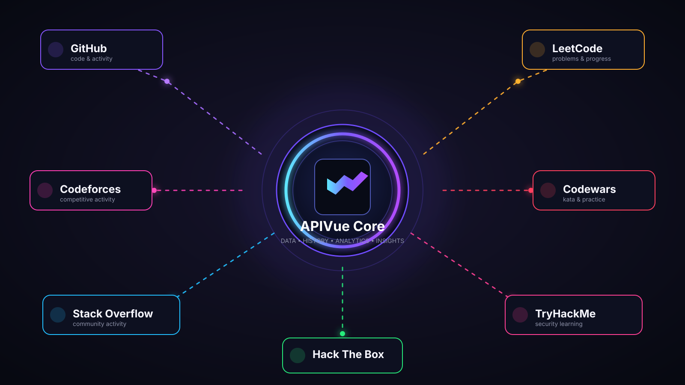

<div align="center">

# ⚡ APIVue

### **Your digital progress, unified.**

APIVue is a personal analytics platform that brings activity, progress, history, comparisons, and insights from the platforms you use into one focused experience.

**Explore → Track → Analyze → Compare → Improve**

<br />



<br />

[](https://www.typescriptlang.org/)
[](https://react.dev/)
[](https://vitejs.dev/)
[](https://supabase.com/)

</div>

---

## 🧠 What is APIVue?

Modern developer life is scattered across dozens of platforms. One profile lives on GitHub, another on Codeforces, another on LeetCode, and meaningful progress can disappear inside each platform's own dashboard.

**APIVue is designed to become the layer above those platforms.**

Instead of asking *“What does this platform say about me?”*, APIVue asks:

> **“What does all of my activity say about my progress?”**

The product is built around a simple pipeline:

```text
Platforms / Public Data / Integrations
                ↓
           Normalization
                ↓
        History & Snapshots
                ↓
            Analytics
                ↓
            Insights
                ↓
          AI Guidance
```

The long-term vision goes beyond developer profiles: APIVue is being designed as a broader personal tracking and analytics platform where data becomes history, history becomes understanding, and understanding becomes useful guidance.

---

## 🌐 The APIVue Core

The center of APIVue is a normalized analytics layer. Different platforms expose different kinds of information, so APIVue's architecture is designed to turn available platform data into a consistent model that can power exploration, analytics, history, and comparison.

### Current platform direction

| Platform | APIVue use case |
| --- | --- |
| 🐙 **GitHub** | Profiles, repositories, activity, languages, contributions and trends |
| 🏆 **Codeforces** | Public competitive-programming profiles and statistics |
| 🧩 **LeetCode** | Public problem-solving progress and available statistics |
| ⚔️ **Codewars** | Public kata/practice activity and profile data |
| 💬 **Stack Overflow** | Public community activity and profile information |

Additional platforms can be added through the existing platform/fetcher architecture as reliable data sources become available.

> **Data integrity matters:** APIVue is designed around real data. Metrics should come from an actual source or a deterministic calculation—not invented numbers.

---

## 🔭 Explore

Explore is the public-facing discovery experience.

Search for a public profile, choose a supported platform, and turn the raw profile into something much easier to understand.

Depending on what a platform actually exposes, APIVue can surface things such as:

- 👤 Profile identity and metadata
- 📦 Repositories / problems / contributions
- ⭐ Stars, followers and other available metrics
- 💻 Language distribution
- 📈 Activity trends
- 🗓️ Recent activity and timelines
- 🔎 Detailed analytics
- ⚖️ Profiles ready for comparison

If a source does not provide a metric, APIVue should show **N/A** rather than pretending the value is zero.

---

## 📊 Analyze

Raw numbers are not the goal. Understanding the numbers is.

APIVue's analytics layer is built to turn activity into measurable patterns, including where the underlying data supports them:

- Total activity
- Active days
- Current and historical streaks
- Growth and period-over-period changes
- Activity over time
- Language breakdowns
- Activity-type breakdowns
- Platform distribution
- Averages, maximums and percentages
- Historical trends from stored snapshots

Charts are intended to communicate real information—not simply decorate the dashboard.

---

## 🕒 History

A profile at one moment tells only part of the story.

APIVue is designed to preserve appropriate **snapshots, events, and historical data** so progress can be viewed over time rather than overwritten every time a profile is refreshed.

That enables questions such as:

```text
How active am I now?
        ↓
How active was I last week?
        ↓
How has my activity changed over time?
        ↓
What patterns keep appearing?
```

When there is not enough historical data, APIVue should say so instead of manufacturing a trend.

---

## ⚖️ Compare

Progress becomes more useful when it can be understood side-by-side.

APIVue is designed to compare compatible metrics between public profiles and connected profiles, including things such as:

- Repositories
- Followers / following
- Stars / forks
- Activity
- Active days
- Languages
- Problem-solving statistics
- Ratings where available
- Recent activity
- Historical trends where sufficient history exists

Different platforms do **not** expose identical metrics. APIVue therefore treats unsupported comparisons as **N/A** instead of making assumptions.

---

## 🎯 Goals & Progress

APIVue also has a goals layer intended to connect analytics with action.

A goal should not be a disconnected checklist. Where the required data exists, APIVue can use measured activity to calculate progress and show the current state of that goal.

```text
Real activity
     ↓
Measured progress
     ↓
Goal status
     ↓
Next action
```

---

## 🤖 AI Insights

AI is a layer **on top of the analytics**, not a replacement for them.

The intended architecture is:

```text
REAL DATA
   ↓
DETERMINISTIC ANALYTICS
   ↓
FACTS + CONTEXT
   ↓
AI INTERPRETATION
   ↓
PERSONAL GUIDANCE
```

That means the AI should reason from measured facts—patterns, changes, activity, goals, and available history—instead of inventing achievements or pretending unavailable data exists.

Potential guidance can include:

- What changed recently
- Which patterns are emerging
- Areas that are improving or declining
- What to focus on next
- Goal suggestions based on observed activity

When no AI provider is configured, the application should degrade gracefully rather than pretending an AI model responded.

---

## 🔐 Integrations & Security

APIVue separates **public exploration** from **authenticated integrations**.

### Public Explore

Public profile data can be explored without claiming ownership of the account.

### Connected Accounts

Authenticated integrations are intended for the user's own accounts and authorized access.

Security principles include:

- 🔒 Keep secrets server-side
- 🛡️ Use legitimate public APIs or OAuth authorization
- 🚫 Never ask users for platform passwords
- 🔑 Never expose OAuth access tokens or service credentials to the client
- 🧱 Enforce user ownership and database access controls
- 🧪 Validate external input and handle API failures safely
- 🌍 Keep API configuration environment-based rather than hardcoding deployment-specific URLs

---

## 🏗️ Architecture

APIVue is currently a **Vite + React + TypeScript** application with a backend/API layer and Supabase integration.

```text
┌──────────────────────────────────────────┐
│                APIVue UI                 │
│ Explore • Analyze • Compare • Goals      │
└───────────────────┬──────────────────────┘
                    │
                    ▼
┌──────────────────────────────────────────┐
│          Normalized Data Layer           │
│ Profiles • Events • Snapshots • Metrics  │
└───────────────────┬──────────────────────┘
                    │
                    ▼
┌──────────────────────────────────────────┐
│           Platform Integrations          │
│ GitHub • Codeforces • LeetCode • ...     │
└───────────────────┬──────────────────────┘
                    │
                    ▼
┌──────────────────────────────────────────┐
│              Supabase / DB               │
│ Auth • Persistence • RLS • History       │
└──────────────────────────────────────────┘
```

### Main technologies

- **React 18** — UI
- **TypeScript** — type-safe application code
- **Vite** — development and production tooling
- **Tailwind CSS** — styling
- **React Router** — application routing
- **Supabase** — authentication, persistence and backend services
- **Express** — server/API layer
- **TanStack Query** — asynchronous data management
- **Recharts** — data visualization
- **Zustand** — client state
- **Zod** — validation
- **Lucide React** — interface icons
- **Vitest** — testing

---

## 🚀 Run APIVue locally

### Prerequisites

- Node.js
- npm
- A Supabase project for authentication/persisted data features

### Install

```bash
git clone https://github.com/Chethan-ULTIMAX/APIVue.git
cd APIVue
npm install
```

### Development

Frontend only:

```bash
npm run dev
```

Frontend + API server:

```bash
npm run dev:all
```

### Checks

```bash
npm run build
npm run typecheck
npm run lint
npm test
```

Environment-specific configuration should be placed in `.env` according to the repository's environment example. **Never commit secrets.**

---

## 🗺️ Product direction

APIVue is being developed in layers rather than as a collection of disconnected dashboards:

```text
                ┌──────────────┐
                │   PLATFORMS  │
                └──────┬───────┘
                       ↓
                ┌──────────────┐
                │     DATA     │
                └──────┬───────┘
                       ↓
                ┌──────────────┐
                │   HISTORY    │
                └──────┬───────┘
                       ↓
                ┌──────────────┐
                │  ANALYTICS   │
                └──────┬───────┘
                       ↓
                ┌──────────────┐
                │   INSIGHTS   │
                └──────┬───────┘
                       ↓
                ┌──────────────┐
                │ AI GUIDANCE  │
                └──────────────┘
```

The objective is simple: **build a system where your scattered digital activity can become one understandable history of progress.**

---

## 🧪 Project status

APIVue is an actively developed project. Features are being implemented and refined across authentication, integrations, public exploration, analytics, history, comparison, goals, and AI-assisted insights.

The repository intentionally avoids claiming functionality that is not actually implemented or backed by real data.

---

## 🤝 Contributing

Ideas, bug reports, architecture discussions, and improvements are welcome.

When contributing, keep the core principles in mind:

1. **Real data over fake numbers.**
2. **Secure integrations over shortcuts.**
3. **Reusable architecture over one-off hacks.**
4. **Useful analytics over decorative charts.**
5. **Graceful failure over pretending everything succeeded.**

---

<div align="center">

### ⚡ APIVue
**One place to see the bigger picture.**

Built with curiosity, data, and a lot of code.

</div>
